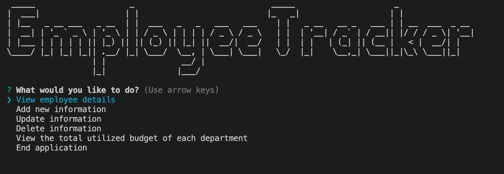

  # Employee Tracker
  

  ## Preview
  

  ## Description
  * The Employee Tracker App helps you view and manage the departments, roles, and employees in your company.
  * Functionality demo on Youtube: https://youtu.be/RVvN_JSdXt0

  ## Table of Contents
  * [Installation](#installation)
  * [Usage](#Usage)
  * [License](#License)
  * [Contributing](#Contributing)
  * [Questions](#Questions)

  ## Installation
  To install necessary dependencies, run the following command:

      npm i

  ## Usage
  1. Please fork this repository to your folder and install dependencies.
  2. Next step is to run `node index.js` in Node.js, and then follow the prompts to manage your employees.
  3. You will need to install MySQL and MySQL workbench in your computer.
  4. Remember to change password in `index.js` line 13 to your MySQL password.

  ## License
  * MIT

  ## Contributing
  The app is contributed by Melody Lo.

  ## Questions
  * If you have any questions, feel free to contact me via email: yiling.melody.lo@gmail.com
  * My GitHub profile: https://github.com/roukell

  